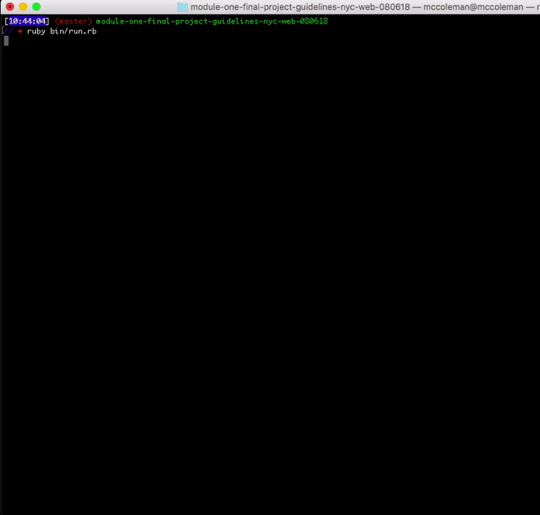

MEETUP APP :thumbsup:
======================

## Objectives

Description:erere

>"Are you feeling lonely in NYC?!?! It's a big city  and there are many things to do with many people! Our application connects you to people with similar interests!"

Our application helps those who are 6interested in participating in meet-ups, either in the role of a user or an organizer. The application both retrieves data & allows certain fields to be edited.

  User Stories

   1. As an organizer, I want to be able to change the time of an event.

   2. As a participant, I want to be able to cancel an events.

   3. As a user, I want to see the most popular events.

   4. As a user, I want to be able to see the most popular organizers.

   5. As a user / participant I'm able to look back on the events I've participated in.

